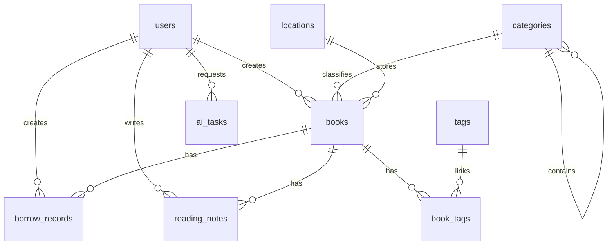

# Home Library 数据库设计

## 1. 设计原则

- MVP 使用 SQLite。
- 表名和字段名使用 `snake_case`。
- 主键使用自增整数 `id`。
- 时间字段使用带时区的 ISO 8601 字符串，数据库层可用 `DateTime(timezone=True)`。
- 金额使用整数分保存，如 `price_cents`。
- 软删除可后续扩展，MVP 阶段先通过删除保护降低复杂度。
- 分类和位置被图书引用时禁止删除。
- AI 和外部检索结果保留原始 JSON，便于追踪来源。

## 2. 实体关系概览



## 3. 表结构

## 3.1 users

用户表。

| 字段 | 类型 | 约束 | 说明 |
| --- | --- | --- | --- |
| `id` | integer | PK | 用户 ID |
| `username` | varchar(64) | unique, not null | 登录名 |
| `password_hash` | varchar(255) | not null | 密码哈希 |
| `display_name` | varchar(100) | not null | 显示名 |
| `role` | varchar(20) | not null | `admin`、`member`、`guest` |
| `email` | varchar(255) | nullable | 邮箱 |
| `status` | varchar(20) | not null | `active`、`disabled` |
| `last_login_at` | datetime | nullable | 最近登录时间 |
| `created_at` | datetime | not null | 创建时间 |
| `updated_at` | datetime | not null | 更新时间 |

索引：

- `idx_users_username`
- `idx_users_role`
- `idx_users_status`

## 3.2 categories

分类表，支持简化中图法和自定义分类。

| 字段 | 类型 | 约束 | 说明 |
| --- | --- | --- | --- |
| `id` | integer | PK | 分类 ID |
| `code` | varchar(32) | unique, not null | 分类号 |
| `name` | varchar(120) | not null | 分类名 |
| `parent_id` | integer | FK categories.id, nullable | 父分类 |
| `description` | text | nullable | 说明 |
| `sort_order` | integer | not null default 0 | 排序 |
| `is_system` | boolean | not null default false | 是否系统内置 |
| `created_at` | datetime | not null | 创建时间 |
| `updated_at` | datetime | not null | 更新时间 |

索引：

- `idx_categories_code`
- `idx_categories_parent_id`

删除规则：

- `is_system=true` 的分类不能删除。
- 已被图书引用的分类不能删除。

## 3.3 locations

位置表。

| 字段 | 类型 | 约束 | 说明 |
| --- | --- | --- | --- |
| `id` | integer | PK | 位置 ID |
| `room` | varchar(80) | not null | 房间 |
| `shelf` | varchar(80) | not null | 书架 |
| `layer` | varchar(80) | nullable | 层数 |
| `position` | varchar(120) | nullable | 具体位置 |
| `full_path` | varchar(400) | not null | 完整路径 |
| `description` | text | nullable | 说明 |
| `sort_order` | integer | not null default 0 | 排序 |
| `created_at` | datetime | not null | 创建时间 |
| `updated_at` | datetime | not null | 更新时间 |

索引：

- `idx_locations_room`
- `idx_locations_shelf`
- `idx_locations_full_path`

唯一性建议：

- `room + shelf + layer + position` 唯一。

## 3.4 books

图书表。

| 字段 | 类型 | 约束 | 说明 |
| --- | --- | --- | --- |
| `id` | integer | PK | 图书 ID |
| `title` | varchar(255) | not null | 书名 |
| `subtitle` | varchar(255) | nullable | 副标题 |
| `author` | varchar(255) | nullable | 作者 |
| `translator` | varchar(255) | nullable | 译者 |
| `publisher` | varchar(255) | nullable | 出版社 |
| `publish_year` | integer | nullable | 出版年份 |
| `isbn` | varchar(32) | nullable | 标准 ISBN |
| `original_isbn` | varchar(64) | nullable | 原始 ISBN 输入 |
| `language` | varchar(32) | nullable | 语言 |
| `pages` | integer | nullable | 页数 |
| `price_cents` | integer | nullable | 价格，单位分 |
| `binding` | varchar(64) | nullable | 装帧 |
| `series` | varchar(255) | nullable | 丛书 |
| `cover_url` | text | nullable | 封面 URL |
| `summary` | text | nullable | 内容简介 |
| `author_intro` | text | nullable | 作者简介 |
| `category_id` | integer | FK categories.id, nullable | 分类 |
| `location_id` | integer | FK locations.id, nullable | 位置 |
| `status` | varchar(20) | not null default `available` | 图书状态 |
| `read_status` | varchar(20) | not null default `unread` | 阅读状态 |
| `rating` | integer | nullable | 评分，1-5 |
| `is_favorite` | boolean | not null default false | 是否重点收藏 |
| `source` | varchar(32) | not null default `manual` | 数据来源 |
| `note` | text | nullable | 备注 |
| `created_by` | integer | FK users.id, nullable | 创建人 |
| `updated_by` | integer | FK users.id, nullable | 更新人 |
| `created_at` | datetime | not null | 创建时间 |
| `updated_at` | datetime | not null | 更新时间 |

索引：

- `idx_books_title`
- `idx_books_author`
- `idx_books_isbn`
- `idx_books_publisher`
- `idx_books_category_id`
- `idx_books_location_id`
- `idx_books_status`
- `idx_books_read_status`
- `idx_books_created_at`

FTS 建议：

- SQLite FTS5 虚拟表 `books_fts`
- 字段：`title`、`subtitle`、`author`、`publisher`、`isbn`、`summary`、`note`

## 3.5 tags

标签表。

| 字段 | 类型 | 约束 | 说明 |
| --- | --- | --- | --- |
| `id` | integer | PK | 标签 ID |
| `name` | varchar(80) | unique, not null | 标签名 |
| `color` | varchar(20) | nullable | 颜色 |
| `created_at` | datetime | not null | 创建时间 |

## 3.6 book_tags

图书和标签关联表。

| 字段 | 类型 | 约束 | 说明 |
| --- | --- | --- | --- |
| `book_id` | integer | PK, FK books.id | 图书 ID |
| `tag_id` | integer | PK, FK tags.id | 标签 ID |

索引：

- `idx_book_tags_book_id`
- `idx_book_tags_tag_id`

## 3.7 borrow_records

借阅记录表。

| 字段 | 类型 | 约束 | 说明 |
| --- | --- | --- | --- |
| `id` | integer | PK | 记录 ID |
| `book_id` | integer | FK books.id, not null | 图书 |
| `borrower_name` | varchar(120) | not null | 借阅人 |
| `borrower_contact` | varchar(255) | nullable | 联系方式 |
| `borrowed_at` | date | not null | 借出日期 |
| `due_at` | date | nullable | 应还日期 |
| `returned_at` | date | nullable | 归还日期 |
| `status` | varchar(20) | not null | `active`、`returned`、`overdue` |
| `note` | text | nullable | 备注 |
| `created_by` | integer | FK users.id, nullable | 创建人 |
| `created_at` | datetime | not null | 创建时间 |
| `updated_at` | datetime | not null | 更新时间 |

索引：

- `idx_borrow_records_book_id`
- `idx_borrow_records_status`
- `idx_borrow_records_due_at`

约束：

- 同一本书同一时间只能有一条 `active` 借阅记录。

## 3.8 reading_notes

阅读笔记表。

| 字段 | 类型 | 约束 | 说明 |
| --- | --- | --- | --- |
| `id` | integer | PK | 笔记 ID |
| `book_id` | integer | FK books.id, not null | 图书 |
| `user_id` | integer | FK users.id, not null | 用户 |
| `title` | varchar(255) | not null | 标题 |
| `content` | text | nullable | Markdown 内容 |
| `progress` | integer | nullable | 阅读进度 0-100 |
| `rating` | integer | nullable | 评分 1-5 |
| `started_at` | date | nullable | 开始日期 |
| `finished_at` | date | nullable | 完成日期 |
| `created_at` | datetime | not null | 创建时间 |
| `updated_at` | datetime | not null | 更新时间 |

索引：

- `idx_reading_notes_book_id`
- `idx_reading_notes_user_id`

## 3.9 external_book_results

外部书籍检索缓存表。

| 字段 | 类型 | 约束 | 说明 |
| --- | --- | --- | --- |
| `id` | integer | PK | 缓存 ID |
| `query` | varchar(500) | not null | 查询词 |
| `source` | varchar(80) | not null | 数据源 |
| `source_id` | varchar(255) | nullable | 外部 ID |
| `raw_data` | json/text | not null | 原始数据 |
| `normalized_data` | json/text | not null | 归一化数据 |
| `created_at` | datetime | not null | 创建时间 |

索引：

- `idx_external_book_results_query`
- `idx_external_book_results_source`
- `idx_external_book_results_source_id`

## 3.10 ai_tasks

AI 任务记录表。

| 字段 | 类型 | 约束 | 说明 |
| --- | --- | --- | --- |
| `id` | integer | PK | 任务 ID |
| `task_type` | varchar(80) | not null | 任务类型 |
| `model` | varchar(120) | nullable | 模型 |
| `input_data` | json/text | not null | 输入 |
| `output_data` | json/text | nullable | 输出 |
| `status` | varchar(20) | not null | `success`、`failed` |
| `error_message` | text | nullable | 错误 |
| `created_by` | integer | FK users.id, nullable | 请求人 |
| `created_at` | datetime | not null | 创建时间 |
| `updated_at` | datetime | not null | 更新时间 |

索引：

- `idx_ai_tasks_task_type`
- `idx_ai_tasks_model`
- `idx_ai_tasks_status`

## 4. 初始化数据

### 4.1 默认管理员

通过环境变量配置：

```text
INITIAL_ADMIN_USERNAME=admin
INITIAL_ADMIN_PASSWORD=change-me
```

首次启动时，如果用户表为空，创建默认管理员。

### 4.2 简化中图法分类

一级分类必须初始化：

```text
A 马克思主义、列宁主义、毛泽东思想、邓小平理论
B 哲学、宗教
C 社会科学总论
D 政治、法律
E 军事
F 经济
G 文化、科学、教育、体育
H 语言、文字
I 文学
J 艺术
K 历史、地理
N 自然科学总论
O 数理科学和化学
P 天文学、地球科学
Q 生物科学
R 医药、卫生
S 农业科学
T 工业技术
U 交通运输
V 航空、航天
X 环境科学、安全科学
Z 综合性图书
```

常用二级分类可同步初始化：

```text
B2 中国哲学
B5 西方哲学
C91 社会学
D9 法律
F0 经济学
F8 金融、投资
G4 教育
G6 儿童教育
H3 外语学习
I2 中国文学
I3 亚洲文学
I5 欧洲文学
I7 美洲文学
J2 绘画
J6 音乐
K2 中国历史
K5 世界历史
O1 数学
R2 中医
R4 临床医学
T9 计算机技术
Z1 丛书、文库
```

## 5. 迁移策略

MVP：

- 使用 Alembic 管理数据库迁移。
- 初始迁移包含全部核心表。
- 种子数据由 `init_db.py` 写入。

后续：

- SQLite 迁移到 PostgreSQL 时，保持字段类型兼容。
- JSON 字段在 SQLite 中可用 TEXT 保存，在 PostgreSQL 中可升级为 JSONB。

